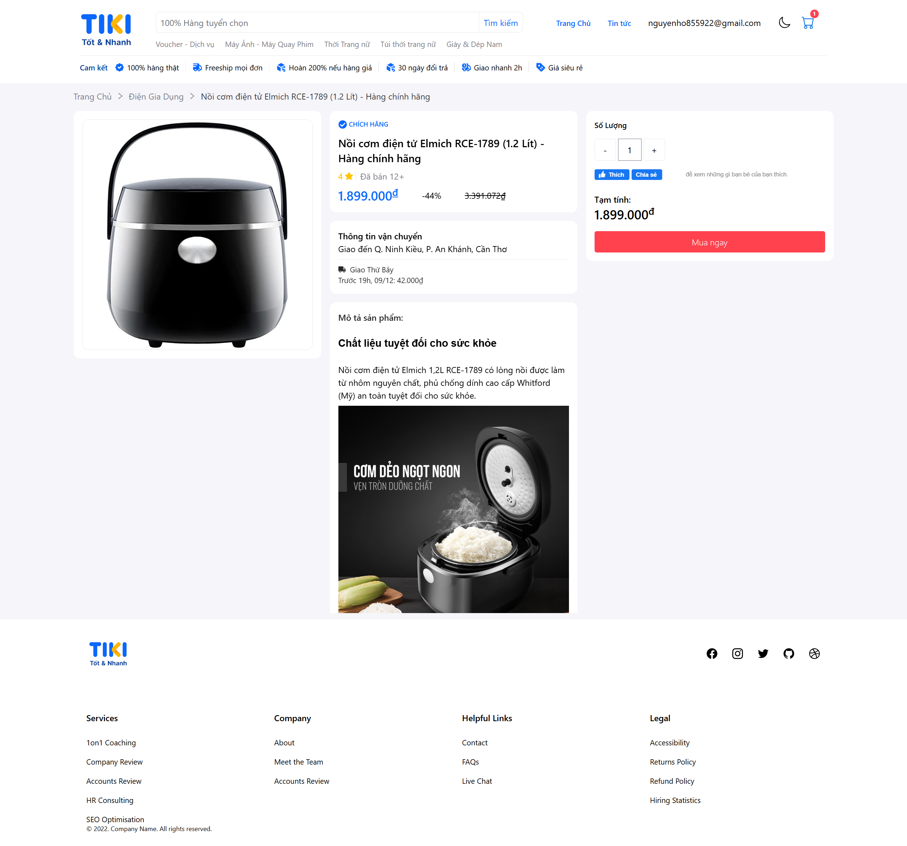

# 🛒 Tiki Frontend Clone

Dự án **Clone giao diện website Tiki.vn** bằng ReactJS  
Mục đích: Học tập, rèn luyện kỹ năng Frontend, ReactJS, Redux, UI/UX.

---

## 🚀 Tính năng chính
- Trang chủ (Home)
- Danh mục sản phẩm
- Trang chi tiết sản phẩm
- Trang tin tức
- Trang chi tiết tin tức
- Giỏ hàng (Cart)
- Trang hóa đơn khi mua sản phẩm
- Tìm kiếm sản phẩm
- Đăng nhập / Đăng ký (giả lập)
- Thanh toán Paypal & COD

---

## 🛠 Công nghệ sử dụng
- ⚛ **ReactJS** (Hooks, Functional Components)
- 📦 **Redux / Redux Toolkit**: quản lý trạng thái
- 🌐 **React Router DOM**: điều hướng
- 💅 **Tailwindcss**: styling
- 🖼 **React-query**: call API
- 🎉 Các thư viện hỗ trợ khác: react-icons, jwt-decode...

---

## 📦 Cài đặt
```bash
# Clone repo
git clone https://github.com/NguyenDongHo-dev/fontend-tiki.git

# Cài đặt thư viện
cd fontend-tiki
npm install
```

---
## 🏃‍♂️ Chạy dự án
```bash
npm run start
```

---

## ⚠️ Tạo file .env với biến
```bash
REACT_APP_PAYPAL_CLIENT_ID=
REACT_APP_API_URL=

```
---

## 📂 Cấu trúc thư mục


```bash
tiki-frontend-clone/
├── public/                  # File tĩnh (index.html, favicon, v.v.)
├── src/                     # Toàn bộ source code
│   ├── ass/                 # Hình ảnh
│   │   ├── images/
│   │
│   │   
│   │     
│   │
│   ├── components/          # Component dùng chung (Header, Footer, Button Card...)
│   │   ├── Header/
│   │   ├── Footer/
│   │   └── Layouts/         # Layout tổng (MainLayout, AuthLayout...)
├   ├   └── ...         
│   │
│   ├            
│   │
│   ├── pages/               # Các trang chính
│   │   ├── Home/
│   │   ├── ProductDetail/
│   │   ├── Category/
│   │   ├── Cart/
│   │   └── Login,Register/  # Login, Register
│   │   ├──...
│   │
│   │
│   ├── redux/               # Redux store & slices
│   │   ├── store.js
│   │   └── slices/
│   │       ├── userSlice.js
│   │       └── oderSlice.js
│   │       └── themeSlice.js
│   │       
│   ├── routes/              # Cấu hình routes
│   │   └── index.js
│   │
│   ├── services/            # Gọi API (axios)
│   │   ├── productService.js
│   │   └── authService.js
│   │
│   ├── utils/               # Hàm tiện ích chung (format date, format price.
│   │
│   ├── hooks/               # Tạo ra các hook  
│   │
│   ├── App.js               # Root component
│   ├── index.js             # Entry point
│   
│                   
│── .env                     # Biến môi trường (API_URL, ...)
├── .gitignore
├── package.json
├── README.md
└── tailwind.config.js / package-lock.json

```

---

## 🧑‍💻 Tác giả
👤 Nguyen Dong Ho – [GitHub](https://github.com/NguyenDongHo-dev)

📫 Email: nguyendongho-dev@gmail.com

---
## ⚠ Lưu ý
Đây chỉ là dự án học tập, còn nhiều thiếu sót nên không dùng cho mục đích thương mại.

Dữ liệu sản phẩm và API chỉ mang tính mô phỏng.

---
## 📸 Screenshot



---
## 📄 License
This project is licensed under the MIT License – see the [LICENSE](./LICENSE) file for details